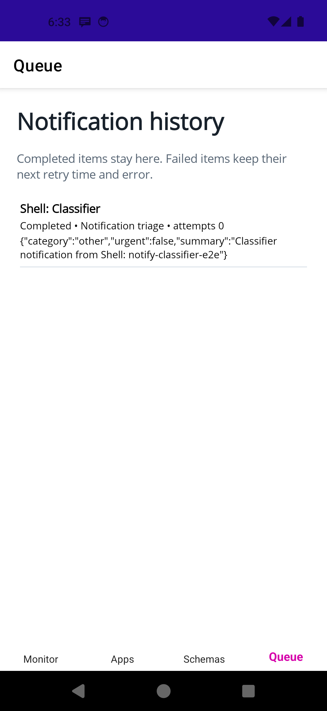

# Notify Classifier

Notify Classifier is an Android app that watches notifications from apps you select and classifies each one into a JSON Schema you control. The phone writes a notification to SQLite before calling the API. An outage changes its state to `RetryScheduled`; it does not delete the row. Android JobScheduler retries periodically and the app also offers a manual retry button.

The local classifier API runs `codex exec` with `gpt-5.6-luna`, the schema supplied by the phone, a read-only sandbox, and an ephemeral session. It uses the ChatGPT login already held by the local Codex CLI. CI replaces the CLI process with a deterministic schema-based classifier and does not need an OpenAI credential.

## Privacy

Notification titles and bodies from selected apps leave the phone and go to the API address configured in the app. Keep the API on a machine and network you trust. Do not select apps whose notifications contain data you are unwilling to send there.

## Run locally

Prerequisites are .NET 11 preview 7, the MAUI Android workload, Aspire CLI 13.5.3 or later, Android SDK, an emulator or device, and Codex CLI signed in through ChatGPT.

```bash
cd notify-classifier
codex login status
dotnet workload install maui-android --skip-manifest-update
aspire start --apphost src/NotifyClassifier.AppHost --non-interactive
```

The API listens at `http://localhost:5080`. The Android emulator reaches it at the app's default address, `http://10.0.2.2:5080`. A physical phone needs the development machine's LAN address.

Build and install the APK:

```bash
./build.sh
adb install -r artifacts/NotifyClassifier.apk
```

Open the app, grant notification access, choose installed apps, and assign a schema. The built-in schema returns `category`, `urgent`, and `summary`.

## Tests and artifacts

`./build.sh` is the Notify Classifier CI entry point. It builds the solution, runs core, SQLite, API, and Aspire end-to-end tests, calculates method CRAP scores, and writes `artifacts/NotifyClassifier.apk`. On pull requests that change covered backend or test inputs, CI requires the maximum CRAP score to decrease from the target-branch value until it reaches 5. It may not rise above 5 after that. CI uploads the APK and coverage inputs for every run.

Merges to `main` that change `notify-classifier/` run the app's CI workflow. Conventional `feat(notify-classifier):`, `fix(notify-classifier):`, and `perf(notify-classifier):` commits select the next version. After CI succeeds, the release workflow publishes the tested APK in a GitHub release tagged `notify-classifier-v<version>`. The shared CRAP score tool has its own workflow and runs only for changes under `tools/`.

The Android device test lives in `scripts/android-e2e.sh`. It installs the APK, grants listener access, selects the Android shell package, posts a real notification, and checks that the retained queue reaches `Completed`.

## UI



The backend and retry data flow are documented in [docs/architecture.md](docs/architecture.md).
