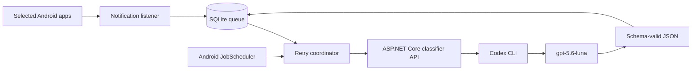

# Architecture

Notify Classifier has one Android client and one local ASP.NET Core classifier API. Aspire owns the API lifecycle and its health check.

The listener snapshots the selected JSON Schema and writes the notification to SQLite before it calls the API. A successful classification updates the same row to `Completed` and keeps the JSON result. A failed request updates it to `RetryScheduled`, increments the attempt count, and assigns the next exponential-backoff time. No processing path deletes notification rows.

Local development runs the API in `CodexCli` mode and uses the existing ChatGPT login from `codex login`. Tests and CI set the Aspire environment to `Testing`, which selects the deterministic classifier and does not need OpenAI credentials.
