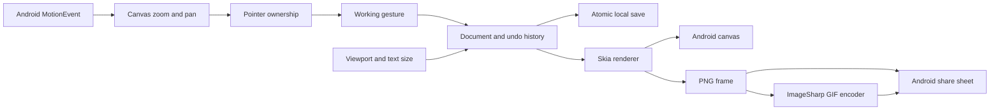

# Document and input behavior

The document stores a supported viewport, ordered elements, and optional end poses keyed by element ID. An end pose changes bounds, opacity, and font size while preserving the source element. Text size defaults to 20 canvas pixels when a saved element omits it. An omitted end font size inherits the element's size.

Viewport changes uniformly scale and center the document, including end poses and trigger coordinates. The first viewport change records a reference size. Subsequent changes use the ratio between each viewport's fit scale against that reference, so orientation and preset round trips do not compound the fit. The reference survives persistence. Coordinates in a wider viewport's extra space remain stored when a narrower viewport clips them. Ink samples stay normalized inside each stroke's bounds. The change enters the same undo history as an object edit.

A gesture edits a working document. Pointer-up commits it to bounded undo history; Android cancellation restores the prior document. The active pointer owns its gesture until release or cancellation. Two-finger navigation cancels the pending drawing gesture and transforms only the canvas view. Pen-only mode rejects finger drawing while allowing this navigation. Text-size dragging previews changes against the original selected element, then commits once on release.

Rendering and exporting use the same drawing code, so playback and files interpolate the same geometry, opacity, and text size. PNG renders at double document resolution. GIF frames scale within a 960-pixel maximum side before encoding. Selection handles use display scale and stay out of exported artwork.

Saving serializes the committed document to a temporary file, then replaces the active file. Writes run under a semaphore. A load error preserves the saved file and blocks autosave until the user explicitly starts or loads a replacement sketch.
