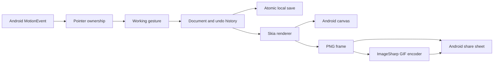

# Document and input behavior

The document stores ordered elements and optional end poses keyed by element ID. An end pose changes bounds and opacity while preserving the source element. This lets freehand strokes, text, and geometric shapes share the same animation model.

A gesture edits a working document. Pointer-up commits it to bounded undo history; Android cancellation restores the prior document. The active pointer owns its gesture until release or cancellation. Pen-only mode rejects finger input at this boundary.

Ink points use coordinates relative to the stroke's bounding box. Resizing the box transforms the stroke without altering its pressure samples. Rendering and exporting use the same drawing code, so playback and files interpolate the same bounds and opacity.

Saving serializes the committed document to a temporary file, then replaces the active file. Writes run under a semaphore. A load error preserves the saved file and blocks autosave until the user explicitly starts or loads a replacement sketch.
